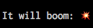

# emoji.cr

[](https://github.com/veelenga/emoji.cr/actions/workflows/crystal.yml)

Emoji library for Crystal. Inspired by [Emoji for Python](https://github.com/carpedm20/emoji)

## Installation

As a dependency in `shard.yml`:

```yaml
dependencies:
  emoji:
    github: veelenga/emoji.cr
    branch: master
```

## Usage

```crystal
require "emoji"

puts Emoji.emojize("I :heart: :beer: and :football:")
```

Will print the following in console:


Also it is possible to remove all emoji from the string:

```crystal
str = Emoji.emojize("Girl on :fire:")
Emoji.sanitize(str) #=> "Girl on "
```

Sanitizing is based on Emoji regex. There are two options available:

- `:simple` emoji regex (default)
- `:generated` emoji regex

Simple regex uses unicode ranges to find emojis and may give some incorrect results.
Generated regex is quite big, but works correctly in 100% cases.
However, it is much slower than a simple regex.

If you need more accuracy sanitizing emojis and don't care about performance, just use generated one:

```crystal
Emoji.sanitize(str, regex: :generated)
```

### Regex

```crystal
require "emoji"

string = "String which contains all kinds of emoji:

- Singleton Emoji: (💎)
- Textual singleton Emoji with Emoji variation: (▶️)
- Emoji with skin tone modifier: (🖐🏼)
- Region flag: (🇺🇦)
- Sub-Region flag: (🏴󠁧󠁢󠁳󠁣󠁴󠁿)
- Keycap sequence: (7️⃣)
- Sequence using ZWJ (zero width joiner): (👨‍👩‍👧‍👦)

"

string.scan(Emoji::GENERATED_EMOJI_REGEX) do |m|
  puts "`#{m[0]}` - #{m[0].size} code points"
end
```

```console
`💎` - 1 code points
`▶️` - 2 code points
`🖐🏼` - 2 code points
`🇺🇦` - 2 code points
`🏴󠁧󠁢󠁳󠁣󠁴󠁿` - 7 code points
`7️⃣` - 3 code points
`👨‍👩‍👧‍👦` - 7 code points
```

### Binary

You may also compile and use `emojize` binary that just prints to console emojized string:

```console
crystal build bin/emojize
./emojize It will boom: :boom:
```



## Resources

- [Unicode® Technical Standard #51](http://unicode.org/reports/tr51/)
- [Emoji Cheat Sheet](http://www.emoji-cheat-sheet.com/)

## Contributing

1. Fork it ( https://github.com/veelenga/emoji.cr/fork )
2. Create your feature branch (git checkout -b my-new-feature)
3. Commit your changes (git commit -am 'Add some feature')
4. Push to the branch (git push origin my-new-feature)
5. Create a new Pull Request
